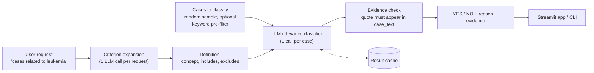

# Design Decisions

The main design decisions, the alternatives considered, and the measured evidence behind
each one. Numbers come from `eval/results/`; the full table is in
`eval/results/SUMMARY.md` and the case-by-case discussion in `eval/ERROR_ANALYSIS.md`.

## Pipeline

Not implemented, described in D8: hybrid retrieval (keyword plus embeddings) as a first
stage in front of the classifier.

## Data model

`OpenMed/multicare-cases` has one row per **article** (`article_id`) with a nested list of
**cases** (`case_id`, `case_text`, `age`, `gender`). The unit of classification is the
**case**: 85,653 articles are flattened to 110,182 cases, each classified on its
`case_text` alone. `age` and `gender` are kept as metadata and are not used for the
decision.

---

## D1. Relevance classification as LLM-based scoring

**Decision.** For each (request, case) pair, one LLM call reads the request and the full
case text together and returns a binary label.

**Alternatives.** Keyword rules per concept (hard-coded, excluded by the brief); an
embedding classifier (D9).

**Why.** Reading the request and the case *together* lets the model weigh how the concept
appears: negated, in the history, as a cause. This is the cross-encoder pattern from
information retrieval: the most accurate way to score a pair, but the score cannot be
pre-computed, so cost grows with the number of cases (D8).

**Evidence.** On the same labeled sets the LLM reaches F1 0.73 (e-scooter) and 0.82
(cardiovascular) with no training examples. The embedding classifier reaches 0.50 and
0.67 and needs labels for each request (D9).

## D2. Expand the request once into an explicit definition

**Decision.** Before any case is classified, one LLM call rewrites the request as a
definition: the concept in one sentence, what counts, and what does not
(`prompts/expand.v1.toml`). The definition is shown to the user and reused for every case.

**Alternatives.** Pass the raw request to every case call (prompts v1 and v2).

**Why.** Requests are ambiguous. Does "cardiovascular disease" include stroke? Is a
"scooter accident" an e-scooter injury? Without a definition, each case call answers that
question on its own. Expanding once, a form of query rewriting, makes the interpretation
consistent across cases and visible to the user, for one extra call per request.

**Evidence.**
- E-scooter: the definition excludes "scooter injury (unspecified type)". Precision rose
  from 0.44 (v1) to 0.57 (v3) with recall unchanged at 1.00.
- Cardiovascular: the definition includes stroke. Recall rose from 0.89 to 1.00; both
  cases missed by v1 were strokes.
- Cost: precision on cardiovascular fell from 0.89 to 0.69, because every term on the
  inclusion list ("hypertension", "arrhythmia") became a trigger, even in past history.

**Not built.** Letting the user edit the definition before running. The interfaces
display it but do not accept changes.

## D3. Prompt structure

**Decision** (`prompts/classify.v3.toml`, the default).
- System instruction: the task and the relevance rules. User message: only the variable
  inputs, each in its own tag: `<request>`, `<definition>`, `<case>`.
- The case text is declared to be data, never instructions.
- Relevant means the concept is explicitly established as a diagnosis, cause, mechanism,
  event or complication of this case. Past history, family history, ruled-out conditions,
  background mentions and look-alikes are not relevant.
- Output is constrained to a JSON schema: `reason` (one sentence), `label` (`YES`/`NO`),
  `evidence` (a short verbatim quote for YES).
- Prompts are versioned files; each holds its text and its output schema. Every result
  records the prompt version. Nothing about a concept is hard-coded: the same template
  serves any request.

**Alternatives tried and measured.**

| Version | Change | E-scooter F1 | Cardiovascular F1 |
|---|---|---|---|
| v1 | Template from the brief, label only | 0.61 | 0.89 |
| v2 | Relevance rules, evidence quote | 0.44 | 0.81 |
| v3 | Expanded definition (D2) | 0.73 | 0.82 |
| v4 | v3 plus an explicit "role" step | 0.80 | 0.84 |

**What this shows.** More instructions did not mean better results. v2 scored below the
baseline on both requests. v2 changed several things at once, so the cause is not
isolated, but the model's reasons suggest that one instruction ("include recognised
subtypes") was applied backwards in some cases. No version wins on both requests: the
baseline has the best F1 on cardiovascular disease and v4 on e-scooter injuries, and with
40 to 60 cases the differences are within a few cases. v4 has a higher F1 than v3 on both
sets, but v3 is the default because it is the only version with no false negatives on
either request: for a filter whose output is reviewed by a person, a missed case costs
more than an extra one, and each YES comes with a quote that makes it quick to dismiss.

## D4. Consistent and verifiable output

**Decision.** Temperature 0; model reasoning ("thinking") disabled; schema-constrained
JSON; the model name and prompt version recorded with every result; responses cached on
(model, prompts, schema, settings). Output that cannot be parsed, or a failed call,
becomes an explicit `ERROR` result, never a silent `NO`. There is no retry on a parse
failure. Temperature 0 makes the output far more stable, but the provider does not
guarantee identical output across calls; exact repeatability here comes from the cache.
Empty responses are not cached.

**Evidence check.** The code verifies that the `evidence` quote appears verbatim in
`case_text`, ignoring case and whitespace, and flags the result if it does not.

**Evidence.**
- 0 unparseable outputs and 0 failed calls across 400 evaluation classifications.
- 31 of 33 quotes for v3 YES answers were found verbatim. The other 2 were correct labels
  with an inexact quote (two sentences joined in one case, a clause dropped in the
  other). The check caught both.
- In a side experiment (results not saved), a 1,024-token reasoning budget changed
  results by one or two cases in either direction and roughly tripled latency, so it
  stays off.

## D5. Long clinical narratives

**Decision.** Measure first. Every case is sent **whole** to the LLM, with no chunking.
Only the embedding path splits long texts: texts above 24,000 characters (a safe margin
below the embedding model's 8,192-token limit; 92 cases in the corpus) are split into
overlapping chunks whose vectors are averaged (`casefilter/embedding.py`). No case in
the evaluation sets is that long, so chunking is unit-tested but was not exercised by
the evaluation.

**Why.** Whole cases preserve context (a cause in paragraph one, the outcome in paragraph
five). Chunking would add complexity and lose that context with no benefit at the LLM
stage.

**Evidence.** `eval/results/length_profile.json`, from exact token counts on 200 random
cases (4.58 characters per token) applied to all 110,182 cases:

| Percentile | p50 | p90 | p99 | p99.9 | max |
|---|---|---|---|---|---|
| Estimated tokens | 547 | 1,133 | 2,297 | 4,927 | 17,310 |

- LLM context (1,048,576 tokens): 0 cases over the limit.
- Embedding input (`gemini-embedding-2`, 8,192 tokens): 23 cases (0.02%) over the limit.

## D6. Ambiguous cases and cases with multiple conditions

**Decision.**
- **Multiple conditions.** A case is relevant when the concept is *a* significant part of
  the case, not only when it is the main diagnosis. The prompt says so explicitly
  ("a complication that the report describes or treats").
- **Ambiguity is recorded, not hidden.** Every reference label is YES or NO, with an
  `ambiguous` flag and a note when the decision is debatable (for example "scooter" with
  no type stated). Metrics are reported both on all cases and without flagged cases.
- **The interpretation is explicit.** The expanded definition (D2) states how the request
  was read, and each YES carries a reason and a quote for a reviewer to check.

**Evidence.** 17 of 100 reference labels are flagged ambiguous. Without them, v3 F1 is
0.86 (e-scooter) and 0.88 (cardiovascular). Six of v3's eleven disagreements fall on
flagged cases.

## D7. Evaluation method

**Decision.**
- Labeling guidelines (`eval/guidelines.md`) were written before labeling, and define
  relevance in the same terms as the prompt.
- Rare concepts need enriched samples: only 40 of 110,182 cases mention a scooter. Each
  test set mixes keyword matches, look-alike cases found by broader keywords (other
  vehicles; secondary cardiac terms such as hypertension or ECG) and random cases
  (`eval/build_candidates.py`). The look-alike patterns are loose: for cardiovascular
  disease 8 of those 10 cases turned out to be relevant, and for e-scooters some matches
  are unrelated text.
- Reference labels (`eval/testsets/*.labels.csv`): each case was read and compared
  against the guidelines. Each YES records the supporting sentence, which is verified to
  appear in the case. The first set was assigned before the classifier was run on those
  cases; after a second independent read, two labels were changed and three more were
  flagged ambiguous. All reported results use the revised labels.
- Reported: precision, recall, F1, the confusion matrix, results per sampling stratum,
  and every false positive and false negative with a category.

**Caveats.** The sets are small and enriched, so precision on the full dataset would be
lower; there are only 4 relevant e-scooter cases, so one label moves recall by 25
points. Prompts v3 and v4 were written after analysing errors on these same cases and
the default was chosen on them, so their scores are optimistic; there is no held-out
set. The prompt rules share wording with the guidelines, which favours the LLM. There is
one set of reference labels and no inter-annotator agreement score.

## D8. Scaling to the complete dataset

**Measured.** With the default prompt a case costs about 1,100 to 1,300 input tokens and
50 output tokens, and takes about 0.75 s. The corpus is about 70M tokens of case text.

**Estimate for one request over all 110,182 cases.** Roughly 130M input tokens, and about
23 hours of sequential calls (about 3 hours with 8 concurrent calls, rate limits
permitting). That is too slow and too costly to repeat for every new request.

**Design (not implemented).** Two stages: retrieve candidates cheaply, then let the LLM
verify only those.
- Keyword search (BM25) suits lexical concepts: all e-scooter cases contain the word
  "scooter", so 40 LLM calls replace 110,182.
- Embedding search suits broad concepts such as cardiovascular disease, where no single
  keyword covers the concept. Case vectors are computed once and reused for every request.
- The two rankings can be merged with reciprocal rank fusion.
- Retrieval recall must be measured, because a case that retrieval misses is never seen
  by the LLM.

**What exists today.** An optional keyword pre-filter in both interfaces, concurrent
calls with retries and backoff, and the response cache. For large batch runs, the
provider's batch API would lower cost further.

## D9. Embedding-based classification (optional extension)

**Decision.** Two embedding approaches were evaluated on the same labeled sets
(`eval/run_embedding_eval.py`), with leave-one-out cross-validation:
1. **Similarity threshold:** cosine similarity between the request and the case.
2. **Logistic regression** trained on case embeddings and their labels. It was chosen
   over a linear SVM or k-nearest neighbours as the simplest of the suggested
   classifiers; with 40 to 60 labeled cases the choice of classifier matters less than
   the number of labels.

**Evidence.**

| | E-scooter F1 | Cardiovascular F1 | Seconds per case | Labels needed per request |
|---|---|---|---|---|
| LLM, prompt v3 | 0.73 | 0.82 | 0.75 | None |
| Embedding + logistic regression | 0.50 | 0.67 | 0.32 (once per case) | Yes |
| Embedding similarity threshold | 0.25 | 0.54 | 0.32 (once per case) | Only a threshold |

**Trade-offs.**
- *Inference time.* About 0.32 s to embed a case, once; classifying it afterwards is a
  dot product or a logistic regression, which takes microseconds. The LLM takes about
  0.75 s per case, for every request.
- *Computational cost.* Embedding the corpus is a one-time cost of about 70M input
  tokens. The LLM needs about 130M input tokens per request over the full corpus
  (case text plus instructions and definition), plus about 50 output tokens per case.
  After the first request the embedding approach costs almost nothing; the LLM cost
  repeats in full.
- *Scalability.* Embeddings scale to the full dataset easily; the LLM does not (D8).
- *Adapting to a new request.* The logistic regression cannot move from leukemia to
  e-scooter injuries without new labeled examples and retraining. The similarity approach
  needs no retraining, but it is not accurate enough: similarity measures topical
  closeness, not whether the condition is present, absent or historical.
- The two approaches are complementary: embeddings to narrow the candidates, the LLM to
  decide (D8).

## D10. Data handling

MultiCaRe consists of published, de-identified case reports, so this project uses the
Gemini API free tier. Free-tier inputs may be used by the provider to improve its
products, which is acceptable for public data but not for real patient records. In a
production public health setting, clinical text should only be sent to an approved model
endpoint or a locally hosted model. The LLM client is a small interface so the provider
can be swapped. Neither API keys nor the downloaded dataset are committed.

## D11. Limitations of using an LLM for this task

- **It errs towards YES.** With the default prompt all 11 disagreements are false
  positives: a matching phrase is treated as sufficient even when the rules exclude it.
- **Sensitive to wording.** Between prompt v1 and v2, e-scooter F1 fell from 0.61 to 0.44.
  Results also depend on how the user phrases the request; the definition makes this
  visible but does not remove it.
- **The definition is generated by the model.** It can differ from what the user means
  (it excluded deep vein thrombosis from cardiovascular disease, for example).
- **Prompt injection.** Case text is inserted unescaped inside `<case>` tags. The only
  defence against instructions embedded in a case is the prompt telling the model to
  treat that text as data.
- **Not every text is a patient case.** Study discussions and questionnaires in the
  dataset are classified as if they were cases.
- **Cost and latency** grow with the number of cases and repeat for each request (D8).
- **Model updates change behaviour.** Results are tied to `gemini-2.5-flash` and the
  recorded prompt versions.
- **Small evaluation.** Differences of a few points between versions are not significant.
- **Not a clinical tool.** Output is a filter for human review, not a diagnosis.
