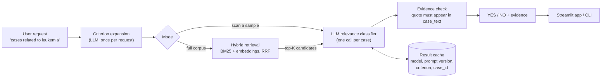

# Design Decisions

This document records the main design decisions, the alternatives considered, and the
evidence behind each choice. Items marked **Evidence: pending** are filled in from
`eval/results/` once the corresponding measurement has run.

## Pipeline

## Data model

The Hugging Face dataset `OpenMed/multicare-cases` has one row per **article**
(`article_id`) with a nested list of **cases** (`case_id`, `case_text`, `age`, `gender`).
The unit of classification is the **case**: rows are flattened so that each `case_id` is
classified independently on its `case_text`. `age` and `gender` are kept as metadata and
are not used for the relevance decision.

---

## D1. Treat relevance classification as LLM-based scoring

**Decision.** For each (criterion, case) pair, a single LLM call reads the criterion and
the full case text together and returns a binary relevance label.

**Alternatives.** Keyword rules per concept (hard-coded, rejected by the brief); an
embedding classifier (see D8).

**Why.** Reading the criterion and the case *together* lets the model reason about their
interaction (negation, history versus current condition, cause versus complication).
This is the cross-encoder pattern from information retrieval: the most accurate way to
score a pair, but the score cannot be pre-computed, so cost grows linearly with the
number of cases. D7 addresses that cost.

**Evidence.** pending

## D2. Expand the criterion once per request

**Decision.** Before any case is classified, one LLM call rewrites the user request into
an explicit definition: the concept, inclusion rules, exclusion rules and common
synonyms. The expansion is shown to the user and reused for every case.

**Alternatives.** Pass the raw request to every case call (baseline, prompt v1).

**Why.** Requests such as "cardiovascular disease" are ambiguous (does stroke count? a
passing mention of hypertension?). If each case call interprets the request
independently, decisions drift across cases. Expanding once, a form of query rewriting,
makes the interpretation consistent, visible and correctable, at the cost of one extra
call per request rather than per case.

**Evidence.** pending (v1 raw request versus v2 expanded request on the same test set)

## D3. Prompt structure

**Decision.**
- The system instruction holds the task and the relevance rules. The user message holds
  the variable inputs: the criterion and the case.
- The case text is wrapped in delimiters and treated as data, never as instructions.
- Relevant means the criterion is a diagnosis, cause or significant finding of *this*
  case. Passing mentions, family history and explicitly excluded conditions are not
  relevant.
- Output is constrained to a JSON schema: `label` (`YES` or `NO`), `evidence` (a short
  verbatim quote) and `reason` (one sentence).
- Templates are versioned files in `prompts/`. Every result records the template version.

**Alternatives.** Free-text `YES`/`NO` (fragile to parse, gives no audit trail);
chain-of-thought reasoning (more tokens per case, multiplied across the corpus).

**Why.** A short evidence quote gives a reviewer something to verify, and the evidence can
be checked automatically (D4). A one-sentence reason keeps cost close to a bare label.

**Evidence.** pending

## D4. Consistent and verifiable output

**Decision.** Temperature 0; schema-constrained output; validation with one retry; an
explicit `ERROR` outcome rather than a silent default to `NO`; the model name and prompt
version are pinned and recorded; results are cached by
(model, prompt version, criterion, case_id).

**Evidence check.** Models can produce quotes that are not in the source. The code checks
that `evidence` actually appears in `case_text` (after whitespace normalisation) and flags
the prediction if it does not.

**Why.** Reproducible runs make prompt comparisons meaningful, and the cache keeps
re-evaluation free.

**Evidence.** pending (parse failure rate, unverified-evidence rate)

## D5. Long clinical narratives

**Decision.** Measure first, then decide. Every case is sent **whole** to the LLM, with
no chunking. Only the embedding stage (D7, D8) needs a long-text strategy: cases above
the embedding model's input limit are split into overlapping chunks whose vectors are
averaged.

**Why.** Sending whole cases preserves context (a cause in paragraph one, the outcome in
paragraph five). Chunking would add complexity and lose that context for no benefit at
the LLM stage. Embedding models have much smaller input limits, so the same corpus does
need handling there.

**Evidence.** `eval/results/length_profile.json`, from exact token counts on 200 random
cases (4.58 characters per token) applied to all 110,182 cases:

| Percentile | p50 | p90 | p99 | p99.9 | max |
|---|---|---|---|---|---|
| Estimated tokens | 547 | 1,133 | 2,297 | 4,927 | 17,310 |

- LLM context (1,048,576 tokens): 0 cases over the limit.
- Embedding input (`gemini-embedding-2`, 8,192 tokens): 23 cases (0.02%) over the limit.
- The corpus totals roughly 70M tokens, so one full LLM pass costs about 70M input
  tokens per criterion. This is the main argument for D7.

## D6. Evaluation methodology

**Decision.**
- Labeling guidelines (`eval/guidelines.md`) are written **before** labeling and match the
  relevance rules in the prompt, so the human and the model apply the same definition.
- Test sets are labeled by a human **blind** to model output and then frozen.
- Rare concepts (for example e-scooter injuries) would give almost no positives in a
  random sample, so each test set combines likely positives (keyword and semantic
  search), random cases and **hard negatives** (for example bicycle or motorcycle
  injuries).
- Metrics: precision, recall, F1, the confusion matrix, and the list of every false
  positive and false negative.
- Each disagreement is categorised as model error, criterion ambiguity or labeling error
  (`eval/ERROR_ANALYSIS.md`).
- A human builds the gold labels. An LLM is not used as the judge, because that would
  grade the model with a model.

**Caveat.** Enriched test sets contain far more positives than the full corpus, so
precision on the full dataset would be lower than measured here.

**Evidence.** pending

## D7. Scaling to the full dataset

**Decision.** Two stages. Hybrid retrieval first, then LLM verification of the top
candidates only.
- Keyword search (BM25) handles lexical concepts such as "e-scooter". Embedding search
  handles semantic concepts such as "cardiovascular disease". The two rankings are merged
  with reciprocal rank fusion.
- Retrieval recall@K is measured on the labeled test sets, because whatever retrieval
  misses, the LLM never sees.
- Case embeddings are computed once and stored. Only the request is embedded per query.
- LLM calls are batched with concurrency limits, retries with backoff, and the result
  cache.

**Alternatives.** Classify every case with the LLM (most accurate, but cost and latency
scale with corpus size); retrieval only (cheap, but less precise).

**Evidence.** pending (recall@K, cost and latency per 1,000 cases)

## D8. Embedding-based classification (comparison)

**Decision.** Compare two embedding approaches with the LLM classifier on the same test
sets:
1. **Supervised:** case embeddings plus logistic regression trained on labeled examples.
2. **Zero-shot:** cosine similarity between the expanded criterion and each case, with a
   threshold.

**Trade-off.** Embeddings are computed once and are cheap at query time (the bi-encoder
pattern). The supervised classifier needs new labels and retraining for every new
criterion, which conflicts with the requirement to accept arbitrary requests. The
zero-shot variant needs no retraining, but its threshold needs tuning and it cannot
handle negation well.

**Evidence.** pending (P/R/F1, latency, cost, adaptability)

## D9. Data handling

MultiCaRe consists of published, de-identified case reports, so this project uses the
Gemini API free tier. Free-tier inputs may be used by the provider to improve its
products, which is acceptable for public data but not for real patient records. In a
production public health setting, clinical text should only be sent to an approved model
endpoint or a locally hosted model. The LLM client is a thin interface so the provider
can be swapped. Neither API keys nor the downloaded dataset are committed.

## D10. Known limitations

- Cost and latency grow with the number of cases classified.
- Results depend on how the request is phrased. D2 reduces this but does not remove it.
- Labels for borderline concepts depend on the definition chosen. Two clinicians could
  disagree.
- Test sets are small, so metric differences of a few points are not significant.
- Model updates can change behaviour. Results are tied to a recorded model version.
