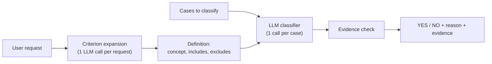

# Clinical Case Filter

Filter clinical cases from the [MultiCaRe](https://huggingface.co/datasets/OpenMed/multicare-cases)
dataset with a request written in plain language:

> Filter the cases related to cardiovascular disease.

> Filter the cases associated with e-scooter injuries.

For each case, an LLM reads `case_text` and answers **YES** (relevant) or **NO**, with a
one-sentence reason and a supporting quote from the case. The request is supplied at
runtime. Nothing about a clinical concept is hard-coded, so the same code handles
leukemia, infectious disease or any other request.

## Where to look

| If you want | Read |
|---|---|
| The design decisions and the reasoning behind them (prompt design, long texts, ambiguity, consistency, scaling, limitations) | **[DESIGN.md](DESIGN.md)** |
| The evaluation results | [eval/results/SUMMARY.md](eval/results/SUMMARY.md) |
| The discussion of every disagreement between the LLM and the reference labels | [eval/ERROR_ANALYSIS.md](eval/ERROR_ANALYSIS.md) |
| Example runs for different requests | [examples/](examples/) |
| The prompt templates | [prompts/](prompts/) |

## Results at a glance

Evaluated on two labeled test sets (60 and 40 cases). Full table:
[eval/results/SUMMARY.md](eval/results/SUMMARY.md). Discussion of every disagreement:
[eval/ERROR_ANALYSIS.md](eval/ERROR_ANALYSIS.md).

| Request | Method | Precision | Recall | F1 | False positives | False negatives |
|---|---|---|---|---|---|---|
| E-scooter injuries | LLM, baseline prompt (v1) | 0.44 | 1.00 | 0.61 | 5 | 0 |
| | **LLM, default prompt (v3)** | 0.57 | **1.00** | 0.73 | 3 | 0 |
| | LLM, stricter prompt (v4) | **0.67** | **1.00** | **0.80** | 2 | 0 |
| | Embeddings + logistic regression | 0.50 | 0.50 | 0.50 | 2 | 2 |
| Cardiovascular disease | LLM, baseline prompt (v1) | **0.89** | 0.89 | **0.89** | 2 | 2 |
| | **LLM, default prompt (v3)** | 0.69 | **1.00** | 0.82 | 8 | 0 |
| | LLM, stricter prompt (v4) | 0.80 | 0.89 | 0.84 | 4 | 2 |
| | Embeddings + logistic regression | 0.73 | 0.61 | 0.67 | 4 | 7 |

The e-scooter set has 4 relevant cases out of 60, the cardiovascular set 18 out of 40.

Three findings:

1. **Defining the request first matters more than adding rules.** A prompt with more
   rules (v2) scored below the baseline. Rewriting the request once into an explicit
   definition (v3) fixed the scope errors: unspecified "scooter" accidents were no longer
   accepted, and strokes were recognised as cardiovascular.
2. **No prompt wins everywhere.** The baseline has the best F1 on cardiovascular disease
   and v4 on e-scooter injuries. v3 is the default because it is the only version that
   misses nothing on either request, and the output is meant for human review, where a
   missed case costs more than an extra one. Its weakness is false positives: it accepts
   cases where a condition appears only in the history. The sets are small, so
   differences of a few cases are not conclusive.
3. **Embeddings are cheaper but do not adapt.** The embedding classifier needs labeled
   examples for every new request and still scored below the LLM. The LLM needs none.

## How it works



1. **Criterion expansion.** The request is rewritten once as a definition: the concept,
   what counts, what does not. The definition is shown to the user.
2. **Classification.** Each case is judged against that definition by
   `gemini-2.5-flash` at temperature 0, with output constrained to a JSON schema.
3. **Evidence check.** For every YES, the code verifies that the quoted evidence really
   appears in the case text.

Design decisions and their measured evidence are in [DESIGN.md](DESIGN.md).

## Setup

Requires Python 3.11 or later. Run every command from the repository root.

### 1. Install

Windows (PowerShell):

```powershell
git clone https://github.com/cheikhwade07/homework_phac.git
cd homework_phac
python -m venv .venv
.venv\Scripts\Activate.ps1
pip install -e ".[dev]"
copy .env.example .env
```

macOS / Linux:

```bash
git clone https://github.com/cheikhwade07/homework_phac.git
cd homework_phac
python -m venv .venv
source .venv/bin/activate
pip install -e ".[dev]"
cp .env.example .env
```

### 2. Add a Gemini API key

1. Open [Google AI Studio](https://aistudio.google.com/apikey) and sign in with a Google
   account.
2. Click **Create API key** and copy it. The free tier is enough and needs no payment
   details.
3. Open the `.env` file created in step 1 and paste the key after `GEMINI_API_KEY=`, with
   no quotes or spaces:

   ```text
   GEMINI_API_KEY=your-key-here
   ```

`.env` is ignored by git, so the key is never committed.

### 3. Check that it works

Without a key (runs the unit tests with a fake LLM, about one second):

```bash
pytest
```

With the key (classifies 5 cases, about 10 seconds after the dataset is downloaded):

```bash
casefilter "Filter the cases related to leukemia." --keyword leukemia --n 5
```

You should see how the request was interpreted, a YES or NO for each of the 5 cases, and
the relevant cases with a reason and a quote.

Notes:
- The first run downloads the dataset (about 185 MB) into `data/`.
- Model responses are cached in `.cache/`, so repeating a run is instant and free.
- If the key is missing, the tool says so and exits. On the free tier a large run may
  pause on a rate limit and then continue by itself.
- The evaluation results in `eval/results/` are committed and can be read without a key.

## Usage

### Web app

```bash
streamlit run app/streamlit_app.py
```

Enter a request (or pick an example), choose how many cases to classify, and run. The app
shows how the request was interpreted, the relevant cases with their evidence, and a
table with the result for every case, which can be downloaded as CSV.

### Command line

```bash
casefilter "Filter the cases related to leukemia." --n 30
casefilter "Filter the cases related to infectious disease." --n 20 --show-text
casefilter "Filter the cases associated with e-scooter injuries." --keyword scooter --n 40
```

| Option | Meaning |
|---|---|
| `--n` | Number of cases to classify (default 20) |
| `--keyword` | Only consider cases containing this word. Useful for rare concepts: only 40 of 110,182 cases mention a scooter, so a random sample would contain none |
| `--seed` | Random seed for the sample |
| `--prompt` | Prompt version (default `classify.v3`) |
| `--show-text` | Print the full text of relevant cases |

Example output (shortened):

```text
Request:    Filter the cases associated with e-scooter injuries.
Classifier: llm:gemini-2.5-flash:classify.v3
Cases:      40 containing 'scooter'

Request interpreted as
  Concept: An e-scooter injury is any bodily harm or damage sustained by an individual as a
  direct result of operating, riding, or being involved in an accident with an electric scooter.
  Counts as the concept: electric scooter accident; e-scooter crash; ...
  Does not count: scooter injury (unspecified type); moped injury; injuries from mobility scooters; ...

Result for each case
NO    PMC10134166_05    A 52-year-old Portuguese gardener was brought to our hospital by an ambulance,...
NO    PMC6742879_01     A 6-year-old girl was injured after falling off a kick scooter. A local physician...
YES   PMC10762359_01    A 70-year-old man visited our clinic with posterior neck pain, right-sided...

Relevant cases: 7 of 40
PMC10837288_01
  evidence: "A 45-year-old man presented via ambulance following an electric scooter crash with a
             chief complain of right upper extremity pain."
  reason:   The case explicitly states the patient was involved in an "electric scooter crash".
```

### Different requests, same code

The request is the only thing that changes. The same 20 random cases (`--n 20 --seed 3`),
three requests, no code change:

| Request | Relevant |
|---|---|
| Filter the cases related to leukemia. | 2 of 20 |
| Filter the cases related to infectious disease. | 8 of 20 |
| Filter the cases related to cardiovascular disease. | 5 of 20 |

The full output of each run is saved in [`examples/`](examples/).

### Choosing how strict the filter is

The default prompt (v3) tells the model to exclude conditions that appear only in the
patient's history, but the model does not reliably follow that rule, so v3 returns those
cases too. The stricter v4 prompt makes the model name the role of the condition first,
and keeps only cases where it is an active part of the case. On 8 cases that all contain
the word "leukemia":

```text
casefilter "Filter the cases related to leukemia." --keyword leukemia --n 8
Relevant cases: 7 of 8

casefilter "Filter the cases related to leukemia." --keyword leukemia --n 8 --prompt classify.v4
Relevant cases: 4 of 8
YES   PMC8382793_01   A 19-year-old male with relapsed ... B cell acute lymphoblastic leukemia ...
NO    PMC6088461_01   A 79-year-old female with past medical history of chronic lymphocytic leukemia (in...
```

The evaluation shows the same trade-off: v3 misses nothing but has more false positives;
v4 is more precise but missed two relevant cardiovascular cases.

## Prompt templates

Prompts are versioned files in [`prompts/`](prompts/). Each file holds the system
instruction, the user template and the output schema.

| File | Purpose |
|---|---|
| [`classify.v3.toml`](prompts/classify.v3.toml) | **Default.** Judges a case against the expanded definition |
| [`expand.v1.toml`](prompts/expand.v1.toml) | Rewrites the request as a definition (used by v3 and v4) |
| [`classify.v1.toml`](prompts/classify.v1.toml) | Baseline: the template from the assignment, unchanged |
| [`classify.v2.toml`](prompts/classify.v2.toml) | Relevance rules and evidence, no definition |
| [`classify.v4.toml`](prompts/classify.v4.toml) | v3 plus an explicit "role" step |

The user message of the default prompt keeps the three inputs apart:

```text
<request>
{classification_criteria}
</request>

<definition>
{criterion_definition}
</definition>

<case>
{case_text}
</case>
```

The expected output is a JSON object: `reason`, `label` (`YES` or `NO`) and `evidence`.

## Evaluation

| File | Content |
|---|---|
| [`eval/guidelines.md`](eval/guidelines.md) | What "relevant" means, written before labeling |
| [`eval/testsets/`](eval/testsets/) | Sampled cases and their reference labels, with the supporting quote |
| [`eval/results/SUMMARY.md`](eval/results/SUMMARY.md) | Precision, recall, F1 and confusion matrix for every method |
| [`eval/results/*.predictions.csv`](eval/results/) | One row per case: reference label, prediction, reason, evidence |
| [`eval/ERROR_ANALYSIS.md`](eval/ERROR_ANALYSIS.md) | Every false positive and false negative, with a category |

**Test sets.** A random sample would contain no e-scooter cases, so each set mixes keyword
matches, look-alike cases found by broader keywords (other vehicles; secondary cardiac
terms) and random cases.

**Reference labels.** Each case was read and compared against the guidelines and given a
YES or NO label, with the sentence the decision rests on recorded and checked to appear in
the case. The first set of labels was assigned before the classifier was run on those
cases. After a second independent read, two labels were changed and three more were
flagged as debatable; all reported results use the revised labels. Debatable cases carry
an `ambiguous` flag (17 of 100), and F1 is also reported without them.

To reproduce:

```bash
python eval/run_eval.py escooter --prompt classify.v3
python eval/run_eval.py cardio --prompt classify.v3
python eval/run_embedding_eval.py escooter
python eval/run_embedding_eval.py cardio
python eval/summarize.py
```

Model responses are cached in `.cache/`, which is not committed. A rerun on another
machine calls the API again, and results can differ by a case or two, because the
provider does not guarantee identical output across calls.

## Considerations

Each point is covered in detail in [DESIGN.md](DESIGN.md).

| Question | Short answer |
|---|---|
| Prompt design | Request, definition and case in separate tags; relevance rules in the system instruction; JSON output with reason, label and evidence. Four versions were measured (D3) |
| Long narratives | Measured first: the longest case is about 17,000 tokens against a 1,048,576-token context, so cases are sent whole. Only embeddings need chunking (D5) |
| Ambiguous cases | The request is expanded into an explicit definition; debatable reference labels are flagged and reported separately (D2, D6) |
| Multiple conditions | A case is relevant if the concept is a significant part of it, not only the main diagnosis (D6) |
| Consistent output | Temperature 0, reasoning disabled, schema-constrained JSON, cached responses, quote verification; failures become `ERROR`, never a silent `NO` (D4) |
| Scaling to the full dataset | About 130M input tokens per request if every case is classified. The proposed design retrieves candidates first (keywords plus embeddings) and lets the LLM verify them (D8) |
| Limitations | Errs towards YES, sensitive to wording, depends on a model-generated definition, small evaluation, cost per request (D11) |

## Tests

```bash
ruff check .
pytest
```

59 unit tests cover output parsing, prompt rendering, criterion expansion, the evidence
check, metrics, case selection, caching, text chunking and command-line validation. The LLM is replaced by a fake
client, so the tests run without an API key. GitHub Actions runs both commands on every
push.

## Repository layout

```
prompts/          versioned prompt templates
src/casefilter/   library: data, LLM client, expansion, classifier, embeddings, metrics, CLI
app/              Streamlit interface
eval/             guidelines, test sets, evaluation scripts, results, error analysis
examples/         saved output for four different requests
scripts/          token-length profile of the dataset
tests/            unit tests
```

## Limitations

- The evaluation sets are small and enriched with likely positives; precision on the full
  dataset would be lower. The e-scooter set has only 4 relevant cases.
- Prompts v3 and v4 were written after analysing errors on the same test sets, and the
  default was chosen on them, so their scores are optimistic. There is no held-out set.
- There is one set of reference labels and no inter-annotator agreement score.
- The model does not reliably apply the exclusion rules (history-only mentions, isolated
  signs, incidental findings), which causes most false positives.
- Hybrid retrieval for full-dataset runs is designed (DESIGN.md, D8) but not implemented.
- The output is a filter to support human review, not a clinical decision.
